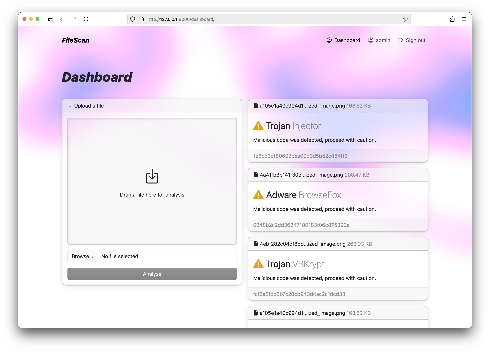

# FileScan

FileScan is a web application that uses an image recognition machine learning model to identify, classify, and predict malware.



## Installation

With Docker installed, navigate to the root directory and run the following command:
```shell
docker compose up --build
```